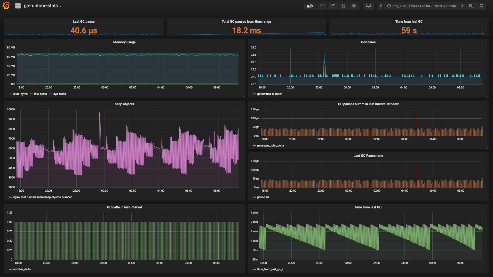

# go-runtime-stats [](https://travis-ci.org/jtaczanowski/go-runtime-stats) [](https://coveralls.io/github/jtaczanowski/go-runtime-stats?branch=master)

go-runtime-stats - Golang package providing collecting go runtime stats and sending it to graphite server.

## Download 
```
go get github.com/jtaczanowski/go-runtime-stats
```
## Example usage (also included in _example catalog):
```go
package main

import "github.com/jtaczanowski/go-runtime-stats"

func main() {
	goruntimestats.Start(goruntimestats.Config{
		GraphiteHost:     "127.0.0.1",
		GraphitePort:     2003,
		GraphiteProtocol: "udp",
		GraphitePrefix:   "metrics.prefix",
		Interval:         60,
		HTTPOn:           true,
		HTTPPort:         9999,
	})

	// insted of empty select (used for block) put your code
	select {}
}
```
## Example Grafana dashboard (JSON file included in _example catalog):


## Metrics description:
| Metric                           | Source                           | Description                                                                                       | Unit               |
|----------------------------------|----------------------------------|---------------------------------------------------------------------------------------------------|--------------------|
| cpu.count                        | runtime.runtime.NumCPU()         | Number of machine CPU                                                                             | number of CPUs     |
| cpu.goroutines_number            | runtime.NumGoroutine()           | Number of goroutines                                                                              | number             |
| cpu.cgo_calls_number_delta       | runtime.NumCgoCall()             | Delta of Cgo calls from last collect interval                                                     | number             |
| cpu.cgo_calls_number_total       | runtime.NumCgoCall()             | Summ of Cgo calls                                                                                 | number             |
| mem.general.alloc_bytes          | runtime.MemStats.Alloc           | Alloc is bytes of allocated heap objects.                                                         | bytes              |
| mem.general.total_bytes          | runtime.MemStats.TotalAlloc      | TotalAlloc is cumulative bytes allocated for heap objects.                                        | bytes              |
| mem.general.sys_bytes            | runtime.MemStats.Sys             | Sys is the total bytes of memory obtained from the OS.                                            | bytes              |
| mem.general.lookups_number_delta | runtime.MemStats.Lookups         | Delta of Lookups from last collect interval                                                       | number             |
| mem.general.mallocs_number_delta | runtime.MemStats.Mallocs         | Delta of Mallocs from last collect interval                                                       | number             |
| mem.general.frees_number_delta   | runtime.MemStats.Frees           | Delta of Frees from last collect interval                                                         | number             |
| mem.general.lookups_number_total | runtime.MemStats.Lookups         | Lookups is the number of pointer lookups performed by the runtime.                                | number             |
| mem.general.mallocs_number_total | runtime.MemStats.Mallocs         | Mallocs is the cumulative count of heap objects allocated.                                        | number             |
| mem.general.frees_number_total   | runtime.MemStats.Frees           | Frees is the cumulative count of heap objects freed.                                              | number             |
| mem.heap.alloc_bytes             | runtime.MemStats.HeapAlloc       | HeapAlloc is bytes of allocated heap objects.                                                     | bytes              |
| mem.heap.sys_bytes               | runtime.MemStats.HeapSys         | HeapSys is bytes of heap memory obtained from the OS.                                             | bytes              |
| mem.heap.idle_bytes              | runtime.MemStats.HeapIdle        | HeapIdle is bytes in idle (unused) spans.                                                         | bytes              |
| mem.heap.inuse_bytes             | runtime.MemStats.HeapInuse       | HeapInuse is bytes in in-use spans.                                                               | bytes              |
| mem.heap.released_bytes          | runtime.MemStats.HeapReleased    | HeapReleased is bytes of physical memory returned to the OS.                                      | bytes              |
| mem.heap.objects_number          | runtime.MemStats.HeapObjects     | HeapObjects is the number of allocated heap objects.                                              | number             |
| mem.stack.inuse_bytes            | runtime.MemStats.StackInuse      | StackInuse is bytes in stack spans.                                                               | bytes              |
| mem.stack.sys_bytes              | runtime.MemStats.StackSys        | StackSys is bytes of stack memory obtained from the OS.                                           | bytes              |
| mem.stack.mspan_inuse_bytes      | runtime.MemStats.MSpanInuse      | MSpanInuse is bytes of allocated mspan structures.                                                | bytes              |
| mem.stack.mspan_sys_bytes        | runtime.MemStats.MSpanSys        | MSpanSys is bytes of memory obtained from the OS for mspan structures.                            | bytes              |
| mem.stack.mcache_inuse_bytes     | runtime.MemStats.MCacheInuse     | MCacheInuse is bytes of allocated mcache structures.                                              | bytes              |
| mem.stack.mcache_sys_bytes       | runtime.MemStats.MCacheSys       | MCacheSys is bytes of memory obtained from the OS for mcache structures.                          | bytes              |
| mem.othersys_bytes               | runtime.MemStats.OtherSys        | OtherSys is bytes of memory in miscellaneous off-heap runtime allocations.                        | bytes              |
| gc.sys_bytes                     | runtime.MemStats.GCSys           | GCSys is bytes of memory in garbage collection metadata.                                          | bytes              |
| gc.next_bytes                    | runtime.MemStats.NextGC          | NextGC is the target heap size of the next GC cycle.                                              | bytes              |
| gc.between_period_s              | runtime.MemStats.LastGC          | Between last two GC period                                                                        | seconds            |
| gc.time_from_last_gc_s           | runtime.MemStats.LastGC          | Seconds from last GC                                                                              | seconds            |
| gc.pause_ns_total_delta          | runtime.MemStats.PauseTotalNs    | PauseTotalNs delta in last collect interval                                                       | nanoseconds        |
| gc.pause_ns_total                | runtime.MemStats.PauseTotalNs    | PauseTotalNs is the cumulative nanoseconds in GC stop-the-world pauses since the program started. | nanosecond         |
| gc.pause_ns                      | runtime.MemStats.PauseNs         | Last GC pause in last collect interval                                                            | nanoseconds        |
| gc.pause_last_ns                 | runtime.MemStats.PauseNs         | Last GC pause                                                                                     | nanosecond         |
| gc.number_delta                  | runtime.MemStats.NumGC           | Delta of GC cycles in last collect interval                                                       | number             |
| gc.number_total                  | runtime.MemStats.NumGC           | NumGC is the number of completed GC cycles.                                                       | number             |
| gc.cpu_fraction_total            | runtime.MemStats.GCCPUFraction   | GCCPUFraction is the fraction of this program's available CPU time used by the GC since the program started.| number   |

All metrics are exposed on HTTP api. Default HTTP server settings: http://localhost:9999

```
root@alpine(ro):~# curl localhost:9999
{
  "cpu": {
    "cpu.count": 2,
    "cpu.goroutines_number": 6,
    "cpu.cgo_calls_number_delta": 0,
    "cpu.cgo_calls_number_total": 1
  },
  "memory": {
    "mem.general.alloc_bytes": 519688,
    "mem.general.total_bytes": 519688,
    "mem.general.sys_bytes": 69926912,
    "mem.general.lookups_number_delta": 0,
    "mem.general.mallocs_number_delta": 577,
    "mem.general.frees_number_delta": 71,
    "mem.general.lookups_number_total": 0,
    "mem.general.mallocs_number_total": 4277,
    "mem.general.frees_number_total": 489,
    "mem.heap.alloc_bytes": 519688,
    "mem.heap.sys_bytes": 66682880,
    "mem.heap.idle_bytes": 65470464,
    "mem.heap.inuse_bytes": 1212416,
    "mem.heap.released_bytes": 0,
    "mem.heap.objects_number": 3788,
    "mem.stack.inuse_bytes": 425984,
    "mem.stack.sys_bytes": 425984,
    "mem.stack.mspan_inuse_bytes": 19608,
    "mem.stack.mspan_sys_bytes": 32768,
    "mem.stack.mcache_inuse_bytes": 3456,
    "mem.stack.mcache_sys_bytes": 16384,
    "mem.othersys_bytes": 531848
  },
  "gc": {
    "gc.sys_bytes": 2234368,
    "gc.next_bytes": 4473924,
    "gc.between_period_s": 0,
    "gc.time_from_last_gc_s": 0,
    "gc.pause_ns_total_delta": 0,
    "gc.pause_ns_total": 0,
    "gc.pause_ns": 0,
    "gc.pause_last_ns": 0,
    "gc.number_delta": 0,
    "gc.number_total": 0,
    "gc.cpu_fraction_total": 0
  }
}
```
Inspired by https://github.com/tevjef/go-runtime-metrics and https://github.com/YoSmudge/go-stats
